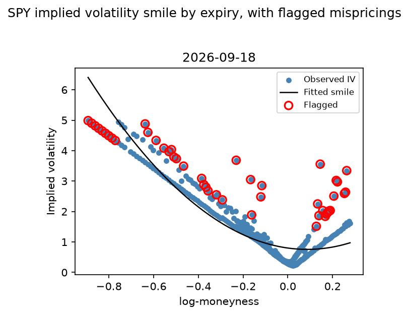
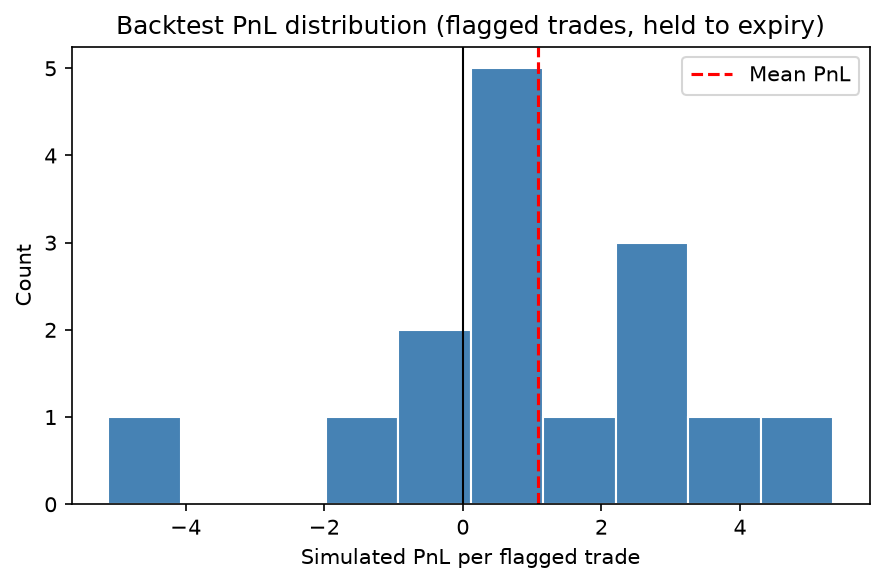

# SPY Options: Implied Volatility Smile Mispricing Signal

A research project built around one question: can you statistically
detect options that are mispriced relative to their own volatility smile,
and does that signal survive scrutiny, or does it just reflect the
well-known volatility risk premium?

## The idea, in plain terms

An option's price depends on one thing the market has to guess: how much
the underlying will move before expiry (volatility). Reverse-engineer that
guess from the market price and you get implied volatility (IV). For a
fixed expiry, IV plotted against strike traces a smooth curve, the
"smile." If one strike's IV sits noticeably off that curve relative to its
neighbors, it's either priced on new information or genuinely mispriced.
This project finds those outliers and tests, rigorously, whether trading
against them would have made money, and whether any edge found is real
or just an artifact of options generally trading above realized volatility.

## Pipeline

| File | Role |
|---|---|
| `black_scholes.py` | Black-Scholes pricer and Greeks, built from first principles, checked against a known textbook value (ATM call ≈ 10.4506) |
| `implied_vol.py` | Solves market price to implied vol via Brent's method (robust near-zero vega, unlike Newton-Raphson) |
| `data_fetch.py` | Pulls a live SPY option chain via `yfinance` (mid price, per expiry) |
| `synthetic_data.py` | Generates a synthetic chain with a realistic smile and known injected mispricings, used to validate the detection logic before trusting it on real data |
| `analysis.py` | Backs out IV per contract, fits a quadratic smile per expiry (IV vs. log-moneyness), flags contracts whose residual z-score exceeds 1.5 |
| `backtest.py` | Simulates trading the flagged contracts (sell "overpriced," buy "underpriced"), holds to expiry, runs a one-sample t-test on PnL vs. zero |
| `comparison.py` | Control test that compares the flagged group's PnL against a "sell everything" baseline, to check whether the signal adds value beyond the general volatility risk premium |
| `main.py` | Runs the full pipeline end to end, produces `iv_smiles.png` and `pnl_distribution.png` |

## Why the control test matters

The first backtest alone isn't enough to trust. Implied volatility tends
to sit above realized volatility on average across the market, a
persistent, well-documented effect called the volatility risk premium.
That means a strategy of selling almost any option can look profitable
for reasons that have nothing to do with smile-relative mispricing
detection. `comparison.py` isolates this: it computes the same simulated
PnL for every contract, not just flagged ones, as a baseline, then runs a
two-sample t-test between the flagged group and that baseline. Only if
the flagged group significantly beats the baseline can the smile-
deviation signal itself be credited with adding value.

## Results on real SPY data

Pulled live via `yfinance` on 16 September 2026 (4 expiries, single-day
snapshot):



- 578 contracts analyzed, 57 flagged as statistically mispriced (|z| >
  1.5 vs. that expiry's fitted smile).
- Signal backtest: mean PnL per flagged trade = 1.80, t = 3.92, p =
  0.0002. Strong on its own, but this alone doesn't prove the smile
  signal is doing anything, which is why the next test matters.
- Control test vs. baseline: baseline "sell everything" mean PnL = 0.63
  (n = 578) vs. flagged-signal mean PnL = 1.80 (n = 57), t = 2.53, p =
  0.0143. The flagged group significantly outperforms the general
  population, meaning the smile-deviation flag is adding predictive
  value beyond the vol risk premium alone, not just riding it.



Validated first on `synthetic_data.py` (which has known injected
mispricings): the detector correctly recovered the injected outliers,
and, as expected on a dataset generated with no real embedded edge, the
control test showed no significant advantage over baseline there, which
is the correct null result for that dataset.

## Honest limitations

- Single-day snapshot. This hasn't been tested out-of-sample across
  multiple dates. The natural next step is re-running it weekly and
  checking whether the signal is stable over time, not just present once.
- No delta hedging. PnL is exposed to the underlying's direction, not
  purely the volatility view, which is not how a real vol-arb desk would
  trade this.
- No transaction costs or bid/ask spread modeling.
- Realized vol in the simulation is a fixed 18% assumption, not
  calibrated to anything. This is exactly the kind of assumption the
  control test exists to stress-test, but it's still a simplification.
- Smile fit is a simple quadratic in log-moneyness. A real desk would use
  something like SVI or a full local vol surface.
- This is a research and learning exercise, not a trading strategy pitch.

## Running it

```bash
python -m venv venv
source venv/bin/activate      # Windows: venv\Scripts\activate
pip install -r requirements.txt
```

By default `main.py` uses `synthetic_data.py`. To run on live data, set
`USE_REAL_DATA = True` at the top of `main.py` and swap the data source
to `get_spy_option_chains()` from `data_fetch.py` (see comments in the
file). Then:

```bash
python main.py
```
